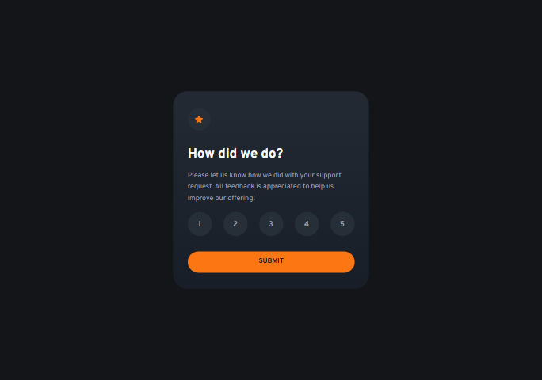

# Frontend Mentor - Interactive rating component solution

This is a solution to the [Interactive rating component challenge on Frontend Mentor](https://www.frontendmentor.io/challenges/interactive-rating-component-koxpeBUmI). Frontend Mentor challenges help you improve your coding skills by building realistic projects.

## Table of contents

- [Overview](#overview)
  - [The challenge](#the-challenge)
  - [Screenshot](#screenshot)
  - [Links](#links)
- [My process](#my-process)
  - [Built with](#built-with)
  - [What I learned](#what-i-learned)
  - [Continued development](#continued-development)
  - [Useful resources](#useful-resources)
- [Author](#author)

## Overview

### The challenge

Users should be able to:

- View the optimal layout for the app depending on their device's screen size
- See hover states for all interactive elements on the page
- Select and submit a number rating
- See the "Thank you" card state after submitting a rating

### Screenshot



### Links

- Solution URL: [link](https://github.com/artemkotko14/interactive-rating-component)
- Live Site URL: [link](https://artemkotko14.github.io/interactive-rating-component/)

## My process

### Built with

- Semantic HTML5 markup
- CSS custom properties
- Flexbox
- Mobile-first workflow
- Keyboard navigation support
- Custom radio buttons
- Vanilla JavaScript

### What I learned

I've learned that to make circle element I need to ensure the width and height of your element are identical and make radius 50%.

```css
width: 42px;
height: 42px;
border-radius: 50%;
```

I’ve learned how to listen for the change event on radio inputs and dynamically update the UI based on the user’s selected rating.

```js
  ratingInput[i].addEventListener("change", function () {
    let selectedRadio = rating.querySelector('input[name="rating"]:checked');
    let selectedLabel = document.querySelector(
      `label[for="${selectedRadio.id}"]`,
    );
};
```

### Continued development

In future projects, I want to continue improving my JavaScript skills, especially working with DOM manipulation, accessibility, keyboard navigation, and interactive UI components. I also want to focus more on writing cleaner, more maintainable CSS and improving responsive layouts.

### Useful resources

- [Full accessibility tree in Chrome DevTools](https://developer.chrome.com/blog/full-accessibility-tree/) - This is an amazing article which helped me to understand how to test my webpage's accessibility.

## Author

- Github - [Artem Kotko](https://github.com/artemkotko14)
- Frontend Mentor - [@artemkotko14](https://www.frontendmentor.io/profile/artemkotko14)
